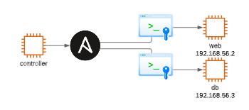

# Infrastructure As Code


## Abstract

This will be my first vagrant free use case of IAC.

We will be utilising **Ansible**  which is language dedicated to provisioning, configuration management and  application management
Ansible is written in YMAL to write scripts or *playbooks*

### Asnsible
*Reasons to use*:
- Simple
- Agentless
- replicates the same action on multiple tens of hundreds of servers.
- Written in python
- Compatibility with Linux-like and Microsoft

#### Installation

*For ubuntu*
```bash
sudo apt-get install software-properties-common && sudo add-repository ppa:ansible/ansible -y && sudo apt-get update -y && sudo apt-get install ansible -y 
```
Physical - 2.7.17 Python version
Cloud - =>3 Python

#### SSH

Be sure to SSH into both machine before hand to exchange the keys `ssh x.x.x.x`

ssh-keyscan -H 192.168.33.10 >> ~/.ssh/known_hosts

#### ping
`ansible all -m ping`
will confirm that all the groups will be pinged

#### *ad hoc*
`ansible all -a "echo memes"
This will allow to implement any kind of linux command to all the groups at once.

#### Hosts file
also know as *inventory*

An example file is found within /ansible/hosts
groups are denoted as [group]
add all the addresses into the group.

##### setting up more arguments with IPS

`192.168.56.2 ansible_connection=ssh ansible_ssh_user=vagrant ansible_ssh_pass=vagrant`


## Questions

- IAC with Ansible
- Configuration Management
	- types of configuration management
		- Ansible
		
- Push and pull config management
- Tools available of IACY

